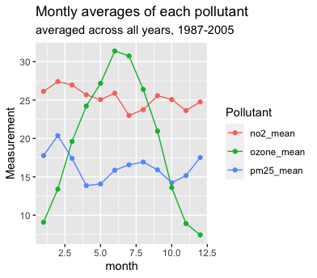
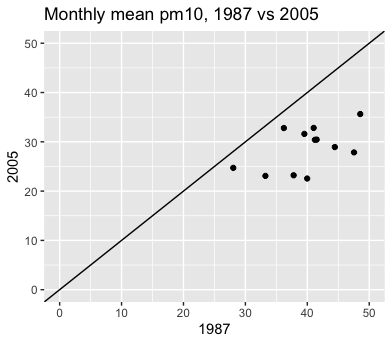

```{r setup, include=FALSE}
knitr::opts_chunk$set(echo = TRUE)
library(tidyverse)
library(Lock5Data)

```

## Getting started

Add the code to load the Lock5Data and tidyverse packages in the code chunk at the start of this document. 

Please remember not to print data sets unless a question specifically asks you to. 


## EE1 Tidy data

Consider the following data containing a log of the number of different hawks observed at a hawk blind. 

```{r}
hawk_data <- tribble(
  ~Species, ~Adult, ~Immature,
  "Cooper",      32,      38, 
  "Red-Tailed",  123,    454, 
  "Sharp-shinned", 69,   192
)
hawk_data
```


a. Explain why this is not "tidy data". To fix it, do we need to make it wider or longer? What are the variables? 

__Your answer:__
This is not "tidy" data because we can make the data set longer by adding a new column that sorts by maturity.


b. Use the appropriate code to make the data tidy (longer). Print the tidy data set. 

```{r}
tidy_hawk_data <- hawk_data %>%
  pivot_longer(names_to = "Maturity",
               values_to = "Number",
               cols = c(Adult, Immature))
tidy_hawk_data

```


## EE 2 Data import excel

Find the spreadsheet of data on all 50 US states, "us_state.xlsx" included in the Week05Exercises folder. Open the spreadsheet in Excel (or numbers) and explore its structure.

Write code to import the 2011 data, making sure that NA values are treated appropriately. Create a histogram of the percentage of residents who have competed in a physical activity in past month (`PhysicalActivity`).

```{r}
#Import excel data set
library(readxl)
us_state <- read_excel("us_state.xlsx", sheet = "2011", 
    na = "-999", skip = 2)
View(us_state)

#Remove NA cases
us_state_complete <- us_state[complete.cases(us_state),]

#Make a histogram
ggplot(us_state_complete, aes(x=PhysicalActivity)) + geom_histogram(binwidth = 1)


```

## EE3 Tidy data visualization

Consider the data `CityTemps` in the Lock5Data package. This data contains mean monthly temperatures in degrees Celsius for the years 2014 and 2015 in each of three cities.

```{r}
head(CityTemps)
```

a. I'd like to make side-by-side boxplots of the temperatures in all three cities. I want the boxplots to all be on the same scale, in the same graph. Is it possible to do this with the data in its current form? If so, please do so. If not, explain why not.

__Your Answer:__ It's not possible because if we want to make side by side boxplots(all be on the same scale, in the same graph) we need to tidy our data set. The reason for this is because: x axis variable need to be categorical. We can do that combining city names as a categorical variable. We can make separate boxplots with the current data set.


```{r}
#Nothing goes here
```


b. Let's try to tidy the data. I'd like to have a longer data set, which includes the columns Year, Month, City, Temperature. It would look something like this:

| Year | Month | City          | Temperature |
|------|-------|---------------|-------------|
| 2014 | 1     | Moscow        | -8.6        |
| 2014 | 1     | Melbourne     | 22          |
| 2014 | 1     | San.Francisco | 12.8        |
| 2014 | 2     | Moscow        | -1.9        |
| ...  | ...   | ...           | ...         |

Write the code to restructure CityTemps into this tidy form. Save the data as `TidyTemps`


__Your Answer:__ 

```{r}
TidyTemps <- CityTemps %>%
  pivot_longer(names_to = "City",
               values_to = "Temperature",
               cols = c(Moscow,Melbourne,San.Francisco))
head(TidyTemps)
```


c. Use your new TidyTemps data to make side-by-side boxplots of the temperatures in all three cities. 

__Your Answer:__ See the graph below.

```{r}
ggplot(TidyTemps, aes(x=City,y=Temperature)) + geom_boxplot()
```


d. What if you wanted to make a scatterplot of the Moscow temperatures and the San Francisco temperatures? Which data set (CityTemps or TidyTemps) would be more useful? Write the code to create this scatterplot. 


__Your Answer:__ I think it would be better and easier to use CityTemps because we have separate variables for each cities.

```{r}
ggplot(CityTemps, aes(x=Moscow,y=San.Francisco)) + geom_point()
```


## EE4 book exercise from R4DS Ch 12

What would happen if you widen this table? Why? How could you add a new column to uniquely identify each value?

Currently the data set is clean and if we want to widen this data set we can use pivot_wider().
We can add a separate columns for age and height. That way, each row can represent a person and it would be easier to read for people who are dealing with the data set. 

```{r}
people <- tribble(
  ~name,             ~key,    ~value,
  #-----------------|--------|------
  "Phillip Woods",   "age",       45,
  "Phillip Woods",   "height",   186,
  "Phillip Woods",   "age",       50,
  "Jessica Cordero", "age",       37,
  "Jessica Cordero", "height",   156
)

```


## EE 5 OPTIONAL Messy data import messages

Suppose you realize at this point that you are going to need the chicago csv for this assignment. You also decide you want to use the `mosaic` package to help explore this data (FYI, I'm a big fan of the `favstats()` function in that package). 

a. Write the code in the code chunk below to load the mosaic package and import the chicago data. Then use favstats() to create a summary of the daily temperature `tempd` (code included; just un-comment it). 

```{r}

#favstats(~tmpd, data = chicago)
```


b. Knit the document and describe the output from your previous code chunk.


__Your answer:__


c. Explore [chunk options](https://rmarkdown.rstudio.com/lesson-3.html) that would let you clean up the output. Change the chunk options in the code chunk in part a. Knit the document again and verify that there are no messages, warnings, etc. from R when you import your data.  Describe what options allowed you to do this.


__Your answer:__


## EE 6 OPTIONAL Challenging graphs

As a bonus for intermediate R users, try using the chicago data to recreate the following graphs.

#### EE6a Monthly averages of each pollutant

```{r}

library(tidyverse)
library(readr)
library(lubridate)

#I commented out my code for this question to knit the file. I don't know why it doesn't work.

chicago <- read_csv("chicago.csv")
#View(chicago)

#tidychicago <- chicago %>%
#  mutate(month = month(date)) %>% #Doesn't work???
#  group_by(month) %>%
#  summarize(mean_pm25 = mean(pm25tmean2), mean_ozone = mean(o3tmean2), mean_no2 = mean(no2tmean2))

#pivot_longer(names_to = "pollutant",
#               values_to = "measurement",
#               cols = c(mean_pm25, mean_ozone, mean_no2))
#head(tidychicago)

#ggplot(tidychicago, aes(x=month,y=measurement,color=pollutant)) + geom_line()
```

month, measurment, pollutant
mean of the temperatures of no2 in a a month 

EX:
month, pollutant meaurment
1         no2 mean    2.6
1         ozone mean    9
1         pm25 mean     18
2
2





#### EE6b pm10 comparison from 1987 to 2005


